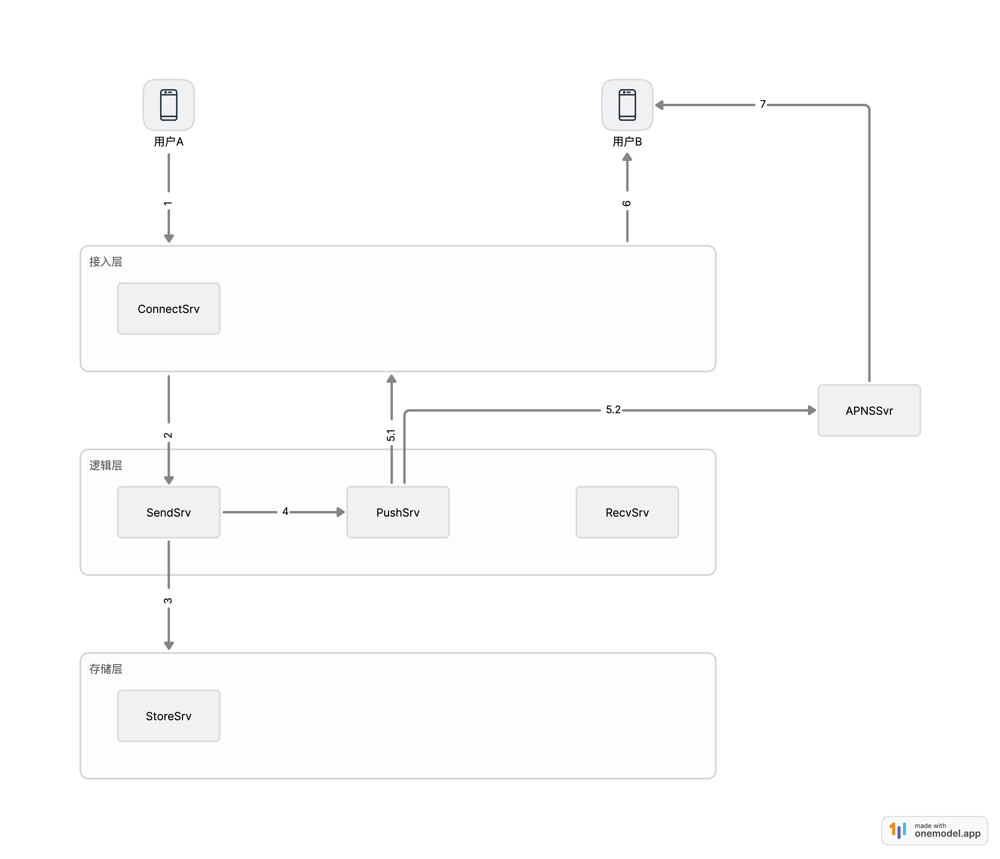
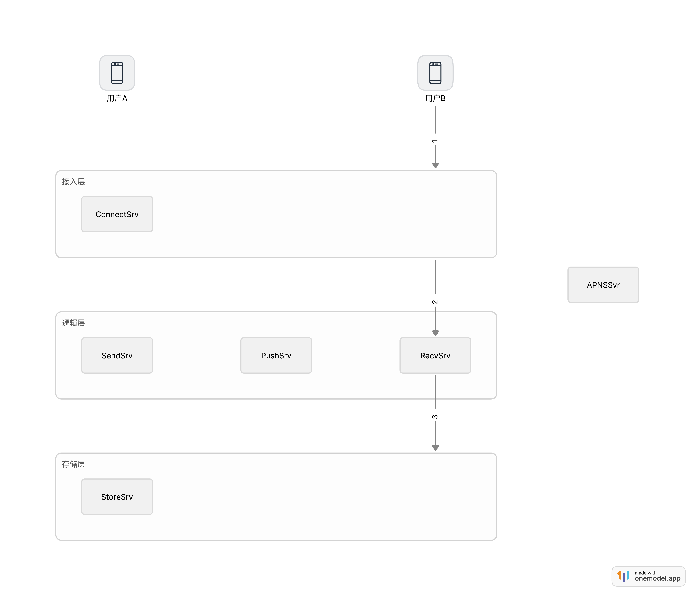
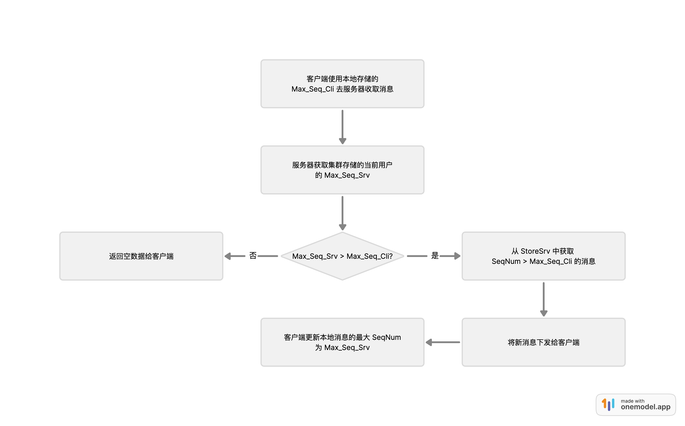

基于邮箱的存储转发机制打造，对消息的收发有2个基本要求：

1. 消息尽可能得实时送达。
2. 消息绝对不能丢。

## 消息收发架构

### 消息发送架构



以用户 A 给用户 B 发送一条消息来看下消息发送架构是如何工作的，在这之前用户 A 和 用户 B 都已与接入层的 ConnnectSrv 服务建立了长连接。

```text
1.1 用户 A 发送新消息请求，请求首先到达接入层的 ConnectSrv 服务。
1.2 ConnnectSrv 收到请求后，给用户 A 回一条相应的 ACK 消息，如果用户 A 没收到 ACK，则认为发送失败，在客户端本地数据库（SQLite）缓存未发送成功的消息，网络恢复后自动重发（拉取服务端 A 对 B 的发送消息ID - s_sid，和本地 A 对 B 的发送消息ID - c_sid做对比，只发送大于 s_sid 的部分）。
2. ConnnectSrv 将消息转发给逻辑层的 SendSrv 服务（消息转发服务）进行处理。
3. SendSrv 将消息存储到存储层的 StoreSrv 中，确保消息持久化。
4. SendSrv 将消息传递给 PushSrv 服务，准备推送给用户 B 新消息到达通知。
5. PushSrv 分两个方向处理消息：
5.1. 尝试通过接入层直接推送给在线的用户 B。
5.2. 同时将消息发送给第三方 Push 系统（如苹果的 ApnsPush）。因为像苹果之类的手机操作系统，在 App 退出到后台持续 10 分钟及以上后，系统会释放掉该 App 持有的所有资源（如 CPU，网络，内存等），导致之前建立的长连接通道也会被一并断掉，此时通过 5.1 的方式消息是不可达的，所以需要借助于厂家自身的 Push 通道来达到消息必触达的目的。
6. 如果用户 B 在线，消息通过接入层直接推送到用户 B 的设备。
7. 第三方 Push 服务器通过自建的 Push 通过将消息推送到用户B的设备。
```

### 消息接收架构



接着来看下用户 B 在收到「新消息通知」后进行消息收取的架构是如何工作的。

```text
1. 用户 B 发起收取消息的请求，请求首先到达接入层的 ConnectSrv 服务。
2. ConnnectSrv 收到请求后，将请求转发到逻辑层的 RecvSrv（消息接收服务）进行处理。
3. RecvSrv 负责从存储层的 StoreSrv 中获取到需要下发的消息。
4, 5, 6. 将增量新消息沿原路往回发送。
```

## 消息防丢失机制

消息收/发架构保证了消息收/发双方能够及时收/发消息，但该架构不能保证消息在传输过程中不发生丢弃。为了达到任意一条消息都不丢的目的，最简单的方案是用户端对收到的每条消息都给服务器进行一次 ACK 确认，该方案的缺点也很明显：在用户设备和服务器之间的交互过多，并且在弱网络情况下也会出现 ACK 丢失的情况。为了优雅得做到消息不丢，该系统对消息收/发引入了 Sequence 机制。

### 什么是 Sequence 机制？

1. A 发给 B的消息部分有42亿的 Sequence 空间（从1到 UINT_MAX），从小到大连续分配。
2. A 发给 B的每条消息都需要分配一个 SequenceNum。
3. 服务器存储有 A 发给 B 的 CurrMaxSequenceNum。
4. 用户 B 的设备存储有已收取到 A 发送的 CurrMaxSequenceNum。

### 消息收取 Sequence 确认机制

当服务器和客户端都拥有了一个 CurrMaxSequenceNum 之后，服务器和客户端之间就可以根据两者的差异来计算新增的待收取消息。



Sequence 确认机制的特定有：

1. 根据服务器和客户端之间 SequenceNum 的差异，可以很轻松得实现增量下发客户端未收取到的消息。
2. 对于弱网情况，丢包发生概率比较高，此时经常会出现服务器的回包不能到达客户端的现象。由于客户端只会在确认收取到消息后才会更新本地的 CurrMaxSequenceNum，所以即使服务器的回包丢了，客户端等待超时后重新拿旧的 CurrMaxSequenceNum 去服务器收取消息，同样是可以正确的收取完未下发的消息。
3. 由于客户端存储的 CurrMaxSequenceNum 是确认收到消息的 SequenceNum，所以对于``客户端每次到服务器来收取消息也可以认为是对上一次收取消息的确认``。一个帐号在多个客户端轮流登录的情况下，只要服务器存储客户端已确认的 SequenceNum，那就可以简单得实现已确认下发的消息不会重复下发，不同客户端之间切换登录也不会收到其他客户端已经收取到的消息。

举几个例子来解释Sequence 确认机制：

```text
 用户设备A
   |       Max_Seq_Cli  Max_Seq_Srv
   |            |            |
   |            |            |
   ∧            ∧            ∧
---+------------+------------+------------> Sequence
   0           100          150
```

假如用户设备A拿 Max_Seq_Cli = 100 去服务器收取消息，此时服务器的 Max_Seq_Srv =  150，那用户设备A可以将会收取 Sequence 为 101 <= Sequence <= 150 的消息，同时用户设备A会将本地的 Max_Seq_Cli 更新为150。

```text
 用户设备A
   |                    Max_Seq_Cli  Max_Seq_Srv
   |                         |            |
   |            |            |            |
   ∧            ∧            ∧            ∧
---+------------+------------+------------+------------> Sequence
   0           100          150          200
```

用户设备A再一次来服务器收取消息，此时 Max_Seq_Cli = 150，服务器的 Max_Seq_Srv = 200，那用户设备A可以将会收取 Sequence 为 151 <= Sequence <= 200 的消息，同时用户设备A会将本地的 Max_Seq_Cli 更新为200。

```text
 用户设备B
   |            Max_Seq_Cli          Max_Seq_Srv
   |                 |                    |
   |            |    |       |            |
   ∧            ∧    ∧       ∧            ∧
---+------------+----+-------+------------+------------> Sequence
   0           100  120     150          200
```

假如用户从设备A切换登录到设备B，并使用 Max_Seq_Cli = 120 来服务器收取消息，由于服务器已经确认 Sequence <= 150 的消息已经被设备A收取下去，故不会再返回 121 <= Sequence <= 150 的消息给设备B，而是将 151 <= Sequence <= 200 的消息下发给设备B。

这里看上去将 151 <= Sequence <= 200 的消息重复下发给了用户的2台设备，但由于设备A在收到 151 <= Sequence <= 200 的消息时并没有给服务器进行确认或者这些消息压根没发送到设备A，所以为了防止消息丢失，151 <= Sequence <= 200 的消息也是需要下发给设备B的。
